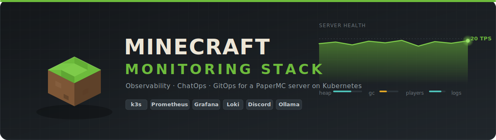
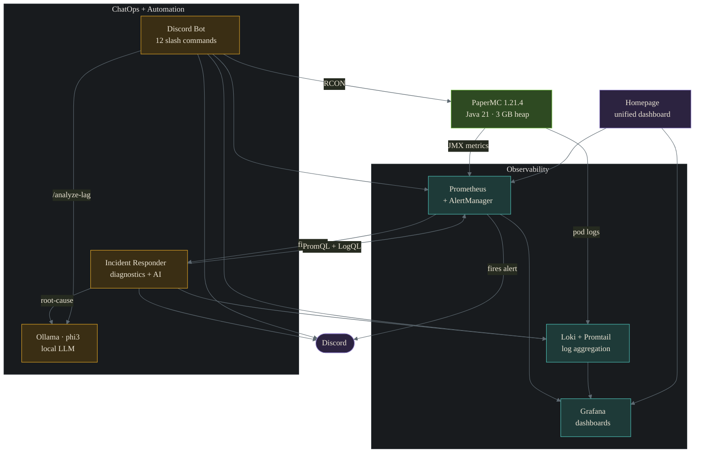

<div align="center">



<br/>

**Production-grade observability and ChatOps for a self-hosted PaperMC server — running on a home k3s cluster, deployed entirely by GitOps.**

<br/>

[](https://github.com/chaitea321/minecraft-monitoring/actions/workflows/pr-validate.yaml)
&nbsp;
&nbsp;
&nbsp;


&nbsp;
&nbsp;
&nbsp;
&nbsp;
&nbsp;
&nbsp;
&nbsp;

</div>

---

A self-hosted platform that gives a Minecraft server the same observability you'd expect from a production service: **Prometheus** metrics, **Grafana** dashboards, **Loki** log aggregation, and **AlertManager** routing to Discord. A custom **Discord bot** turns the chat window into a control plane — status, players, whitelist, backups — and an **incident-responder** enriches every alert with live diagnostics and a local-LLM root-cause analysis before it reaches your phone. Everything ships via **Argo CD** GitOps, with secrets synced from **Azure Key Vault** through the External Secrets Operator.

## Highlights

- **Full observability pipeline** — metrics, logs, dashboards, and alerting wired end-to-end for a single game server, on a 3-node home cluster.
- **ChatOps control plane** — 12 Discord slash commands manage the server over RCON without SSH or a console.
- **AI-assisted incident response** — alerts arrive pre-enriched with live PromQL/LogQL diagnostics and a phi3 (Ollama) root-cause summary, non-blocking by design.
- **GitOps all the way down** — Argo CD App-of-Apps reconciles the entire stack from this repo; zero manual `kubectl apply`.
- **Operable** — daily zstd PVC backups with restore verification, predictive alerts (memory-leak / disk / TPS decline), and CI that lints and validates every manifest.

## Architecture



<div align="center"><sub>Deployed via Argo CD App-of-Apps · secrets synced from Azure Key Vault by the External Secrets Operator · ingress through Traefik sub-paths.</sub></div>

## Features

### Discord bot — 12 slash commands

| Command | Description |
|---------|-------------|
| `/status` | Live TPS, player count, heap usage, and uptime in one embed |
| `/players` | Online players with session play-time |
| `/tps` | Current server tick rate |
| `/uptime` | Server uptime |
| `/session` | Total play-time for a specific player |
| `/top-players` | Leaderboard by play-time |
| `/whitelist` | Add or remove a player from the whitelist *(admin)* |
| `/backup` | Save the world and trigger a backup *(admin)* |
| `/ai-status` | Check whether the Ollama model is online |
| `/analyze-lag` | AI lag analysis from live Prometheus metrics |
| `/summarize` | AI summary of recent server logs from Loki |
| `/help` | List every command |

### Monitoring & dashboards

- **20-panel Grafana dashboard** — TPS, JVM heap, GC rate, CPU/load, player stats, movement, crafting, and health.
- **Minecraft logs dashboard** — live PaperMC log stream with level filtering and error tracking.
- **Homepage** — one-glance status board across every homelab service, with a public Uptime Kuma status page.
- **Alert rules** — server-down, low/critical TPS, high heap (warning + critical), high system load, and no-players.
- **Predictive alerts** — memory-leak (`predict_linear` on heap), disk exhaustion, and TPS decline.
- **Log-based alerts** — high error rate, GC stress, chunk-load pressure, and player-disconnect spikes.
- **PVC backups** — daily zstd-compressed snapshots (3-day retention) at 04:00 CST with Discord notifications and a restore-verification script.

### Automated incident response

When Prometheus fires an alert, the incident-responder:

1. Forwards it to Discord as a rich embed.
2. Gathers live diagnostics from Prometheus (TPS, heap, load, players, uptime).
3. Pulls recent server logs from Loki.
4. Runs a phi3 (Ollama) root-cause analysis.
5. Posts alert + diagnostics + AI embeds together.

AI is **best-effort** — if Ollama is slow (CPU-bound, ~38 s/query) or down, alert delivery is never blocked.

## Tech stack

| Layer | Tool | Role |
|-------|------|------|
| Runtime | **k3s** (v1.34) | Lightweight Kubernetes |
| Server | **PaperMC** 1.21.4 | Minecraft server (Java 21) |
| Metrics | **Prometheus** / kube-prometheus-stack | Collection + alerting |
| Dashboards | **Grafana** | 20-panel Minecraft dashboard |
| Logs | **Loki + Promtail** | Aggregation (7-day retention) |
| Alerting | **AlertManager** | Discord webhook routing |
| GitOps | **Argo CD** | App-of-Apps deployment |
| Secrets | **External Secrets Operator** | Azure Key Vault backend |
| Ingress | **Traefik** | Sub-path routing + middlewares |
| AI | **Ollama + phi3** | Local LLM (2.2 GB model) |
| CI | **GitHub Actions** | YAML lint · Helm lint · kubeconform · Docker build |

## Engineering decisions

Selected problems worth writing down — the kind that don't show up until something is running.

<details open>
<summary><b>One TPS metric, everywhere</b></summary>

<br/>

Tick rate is the headline health signal, and it had been queried three different ways: a histogram (`minecraft_tps_bucket_*`) the exporter never emits, a legacy `forge_tps`, and the dashboard's `paper_tps_1m`. Dashboards, alerts, and the bot silently disagreed. The stack now reads TPS from **one source of truth — the Paper exporter's `paper_tps_1m` gauge —** used identically across Grafana, the PrometheusRules, the Discord bot, and the incident-responder. It's a gauge, not a counter, so no `rate()` gymnastics.
</details>

<details>
<summary><b>Player detection without a player metric</b></summary>

<br/>

PaperMC never emits a `minecraft_player_online` gauge. Online players are inferred from play-time counters that are still advancing:

```promql
increase(minecraft_play_time_ticks_total[5m]) > 0
```
</details>

<details>
<summary><b>AI integration: <code>/api/chat</code> over <code>/api/generate</code></b></summary>

<br/>

Ollama's `/api/generate` ignores chat templates — phi3 echoes the prompt and hallucinates numbers. Switching to `/api/chat` with a structured `messages` array engages phi3's native chat template and lets a system message set guardrails ("use only the data provided", "don't restate the prompt", "don't fabricate numbers") plus server context (PaperMC 1.21.4, 3 GB heap).
</details>

<details>
<summary><b>Ollama memory: <code>num_ctx</code> must ride in the request body</b></summary>

<br/>

Ollama ignores the `OLLAMA_NUM_CTX` environment variable; the context size must be set per request (`"options": {"num_ctx": 2048}`). At the default 4096, the KV cache (~1536 MiB) plus the model (~2075 MiB) blew past the 3Gi limit and OOM-killed the pod (exit `-1`). Halving the context fixed it.
</details>

<details>
<summary><b>Dual-path alerting: fast + enriched</b></summary>

<br/>

AlertManager fans each alert out to a direct Discord webhook (instant) **and** to the incident-responder (enriched). The responder processes asynchronously, so a slow 38-second Ollama call never delays the first notification.
</details>

<details>
<summary><b>Everything on a sub-path</b></summary>

<br/>

Grafana, Prometheus, and Loki are served under `/grafana`, `/prometheus`, `/loki` via Traefik, with matching `routePrefix` / `serve_from_sub_path` / `externalUrl` so deep links and asset loading work behind one host.
</details>

## Log aggregation

```
PaperMC logs → Promtail DaemonSet (/var/log/pods/default_*.log) → Loki (SingleBinary) → Grafana
```

Labelled `{app="minecraft"}`, with level parsing (INFO/WARN/ERROR/FATAL) and derived fields that link log lines back to Prometheus.

```logql
{app="minecraft"}                                  # all logs
{app="minecraft"} |= "ERROR"                       # errors only
count_over_time({app="minecraft"} |= "ERROR" [5m]) # error rate
```

## Repository structure

```
monitoring/
├── argocd/                 # Argo CD Applications (App-of-Apps)
├── discord-bot/            # Discord bot — Python / discord.py
│   ├── cogs/               #   status · admin · ai · help commands
│   ├── prometheus_client.py#   async Prometheus query client
│   └── rcon_client.py      #   RCON protocol client
├── incident-responder/     # Alert → diagnostics → AI → Discord webhook server
├── helm/                   # kube-prometheus-stack Helm values
├── loki/                   # Loki + Promtail Helm values
├── manifests/
│   ├── alerting/           #   PrometheusRules + AlertmanagerConfig
│   ├── automation/         #   memory-restart CronJob + RBAC
│   ├── dashboards/         #   Grafana dashboard ConfigMaps
│   ├── datasources/        #   Grafana datasource ConfigMaps
│   ├── eso/                #   ExternalSecrets + ClusterSecretStore
│   ├── exporters/          #   JMX exporter + ServiceMonitors
│   ├── homepage/           #   Homepage dashboard
│   ├── ingress/            #   Traefik ingress
│   ├── middleware/         #   Traefik middlewares (strip-prefix, rate-limit)
│   ├── ollama/             #   Ollama StatefulSet
│   └── status-page/        #   Uptime Kuma
├── infra/                  # Bicep IaC for Azure AKS (portfolio reference)
└── scripts/                # PVC backup / restore / verify (zstd)
```

## Quick start

<details>
<summary>Deploy · local dev · access · environment</summary>

<br/>

### Deploy

Everything is reconciled by Argo CD via App-of-Apps. Install the root app once; the rest follows from `main`.

```bash
git clone git@github.com:chaitea321/minecraft-monitoring.git
cd minecraft-monitoring
kubectl apply -f argocd/root-app.yaml   # bootstraps every other Application
```

**Prerequisites:** a k3s cluster (v1.21+), Helm v3, `kubectl`, and Traefik (bundled with k3s).

### Local development

```bash
kubeconform -strict -summary manifests/                       # validate manifests
docker build -t evince55/discord-bot:latest discord-bot/      # build images
docker build -t evince55/incident-responder:latest incident-responder/
```

### Access

| Service | Path |
|---------|------|
| Homepage | `/` |
| Grafana | `/grafana/` |
| Prometheus | `/prometheus/` |
| Loki | `/loki/` |
| Argo CD | `/argocd/` |
| Uptime Kuma | `/status/` |

Behind Traefik on the cluster host (`http://<node-ip>/…`, NodePort `30102` for direct access).

### Environment — Discord bot

| Variable | Description | Default |
|----------|-------------|---------|
| `DISCORD_TOKEN` | Bot token | *required* |
| `PROMETHEUS_URL` | Prometheus endpoint | `http://kube-prometheus-stack-prometheus.monitoring:9090/prometheus` |
| `OLLAMA_URL` | Ollama API endpoint | `http://ollama.ollama:11434` |
| `OLLAMA_MODEL` | LLM model name | `phi3` |
| `ADMIN_ROLE_ID` | Discord role for admin commands | — |

### Environment — incident responder

| Variable | Description | Default |
|----------|-------------|---------|
| `DISCORD_WEBHOOK_URL` | Discord webhook URL | *required* |
| `PROMETHEUS_URL` | Prometheus endpoint | `http://kube-prometheus-stack-prometheus.monitoring:9090/prometheus` |
| `LOKI_URL` | Loki gateway endpoint | `http://loki-gateway.monitoring:80` |
| `OLLAMA_URL` | Ollama endpoint (empty = skip AI) | `""` |
| `OLLAMA_MODEL` | LLM model name | `phi3` |

</details>

## License

[MIT](LICENSE)
